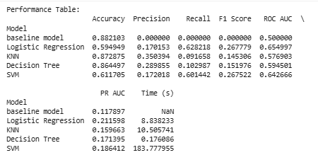
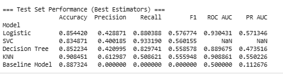

# Module 17: Practical Application 3: Comparing-Classifiers

## Overview

This project applies multiple machine learning classifiers to predict whether a client of a Portuguese bank will subscribe to a term deposit. The primary objective is to compare different classification algorithms—K-Nearest Neighbors, Logistic Regression, Decision Trees, and Support Vector Machines—and determine which performs best on this imbalanced dataset.

Dataset
* Source:  UC Irvine Machine Learning Repository
* Size: 41,188 records × 21 features  
* Target Variable: (`y`): whether the client subscribed to a term deposit (`yes`/`no`)
* Class imbalance: ~88% “no” vs. 12% “yes” 

## Notebooks
- promptt.ipynb: [link to colab notebook code](https://drive.google.com/file/d/1fuCoWHbFDWMGShT5j53yzm_FiJa7bJH0/view?usp=sharing)

## Data Description 
### Feature Groups

#### Client Information (Demographics)
- age: numeric
- job: type of job (e.g., admin., management, student, retired)
- marital: marital status (single, married, divorced/unknown)
- education: education level (basic, high school, university, professional course, etc.)
- default: has credit in default (yes, no, unknown)
- housing: has housing loan (yes, no, unknown)
- loan: has personal loan (yes, no, unknown)

#### Current Campaign Contact Information
- contact: type of communication (cellular, telephone)
- month: last contact month (jan–dec)
- day_of_week: last contact day (mon–fri)
- duration: last contact duration in seconds (note: should be excluded for realistic modeling since it’s only known after the call)

#### Previous Campaign Information
- campaign: number of contacts performed during this campaign
- pdays: number of days since last contact from a previous campaign (999 = not previously contacted)
- previous: number of contacts before this campaign
- poutcome: outcome of the previous campaign (failure, nonexistent, success)

#### Economic Indicators
- emp.var.rate: employment variation rate (quarterly indicator)
- cons.price.idx: consumer price index (monthly indicator)
- cons.conf.idx: consumer confidence index (monthly indicator)
- euribor3m: euribor 3 month rate (daily indicator)
- nr.employed: number of employees (quarterly indicator)

## Data Cleaning/Preprocessing
### Data Cleaning 
- Checked for duplicate rows and dropped them (41188 → 41176 records).
- No true NaN values were found in the dataset.
- -Converted the target column y from strings ("yes"/"no") to numeric (1/0).

### Preprocessing/Feature Engineering
#### Categorical Features
- Used One-Hot Encoding to convert categorical variables (job, marital, education, etc.) into binary dummy variables.
- For binary categorical features (housing, loan, default), applied drop-first encoding to avoid multicollinearity.

#### Numerical Features
- Standardized continuous numeric features (e.g., age, emp.var.rate, euribor3m) using StandardScaler to ensure models like Logistic Regression and SVM handle them correctly.

#### Feature Selection Considerations
- Dropped duration for the “realistic” model, since it is only known after a call is completed and would cause data leakage.
- Kept features from all major categories: client demographics, campaign attributes, and economic indicators.

#### Train/Test Split
- Split data into 80% training and 20% testing.
  
### EDA and Correlation Analysis
#### 1. Target Distribution
- The target variable y is highly imbalanced:
  - No: ~88%
  - Yes: ~12%
This imbalance highlights the need to use metrics beyond accuracy (e.g., Recall, F1, PR AUC).

#### 2. Numerical Features
- Age: Most clients are between 30–60 years old. Conversions are slightly higher among middle-aged and retired clients.
- Duration: Longer calls strongly correlate with positive outcomes, but this feature was excluded for realistic modeling.
- Campaign: Heavily right-skewed. More calls usually lower the chance of conversion → customer fatigue.
- Pdays: A spike at 999 (never contacted before). Smaller values (recent contact) are associated with higher conversions.
- Previous: Most values are 0. Nonzero indicates prior engagement and slightly higher conversion.
  

#### 3. Categorical Features
- Job: Largest groups are admin., blue-collar, technician. Students, retired, and management have higher conversion rates.
- Marital Status: Married is the largest group; single clients convert at slightly higher rates.
- Education: Higher education shows somewhat higher acceptance rates.
- Contact Method: Cellular contacts dominate volume and convert better than telephone.
- Month: Seasonal effects — higher campaign activity in May, but better conversion rates in March, October, and December.
- Day of Week: Fairly uniform distribution; little impact on conversion.

---

## Model Performance Summary (with Cross-Validation):
- Each model was evaluated using a combination of 5-fold cross-validation on the training set and hold-out testing on unseen data. Here's what the performance metrics reveal:

### Run 1: Comparing the Various models 

- Baseline model (most frequent class)
- - Accuracy looks deceptively high (0.88) because the dataset is imbalanced.
  - But Precision/Recall/F1 are all 0.0, which confirms it never predicts the minority class.
  - ROC AUC = 0.50, PR AUC = 0.11 → random performance.

- Logistic Regression / SVM
- - Both achieve reasonable recall (~0.60) but very low precision (~0.17).
  - F1 ~0.27 means they capture positives but misclassify many negatives.
  - Training times are acceptable (Logistic: 9s, SVM: 183s).

- KNN / Decision Tree
- - Both have higher accuracy (~0.87) but terrible recall (<0.10).
  - These models essentially predict negatives most of the time, leading to low F1

### Run 2 with Cross Validation 

- SVC achieved the best F1 (0.24) — but is computationally heavy.
- Logistic Regression is the practical winner — slightly worse F1 but 1000× faster.
- Decision Tree and KNN underperform — either too low recall (Tree) or too low overall accuracy (KNN).
- Baseline shows the importance of recall & F1 — accuracy alone would have been misleading.

  
### Top Categorical Features 

### Top Numerical Features 

## Key Features in Correlation to y

### Strongest Predictors
- nr.employed (-0.35) → Fewer employees in the economy correlates with higher likelihood of subscription.
- pdays (-0.32) → Lower values (recent contact) predict higher success; 999 (“never contacted”) strongly predicts a “no.”
- euribor3m (-0.31) → Lower interest rates increase chances of subscription.
- emp.var.rate (-0.30) → Negative employment variation rate correlates with lower likelihood of subscription.
- previous (+0.23) → More past contacts increase the chance of conversion.

### Moderate Predictors
- poutcome_success (+0.19) → If the client subscribed in a prior campaign, they’re much more likely to subscribe again.
- poutcome_nonexistent (-0.17) → Clients with no previous campaign history are less likely to subscribe.
- month_mar, month_oct, month_sep (+0.13–0.14) → Seasonality effect; certain months show higher campaign effectiveness.

### Weaker but Useful Predictors
- cons.price.idx (-0.14) → Higher consumer price index slightly reduces likelihood of subscription.
- contact_telephone (-0.12) → Telephone contact (landline) predicts lower success vs. cellular.
- month_may (-0.11) → May campaigns are less effective.
- job_student (+0.10) → Students are more likely to subscribe.
- default_no (+0.09) → Clients with no default history are slightly more likely to subscribe.
  
Use only the top 20 Features to compare the models again to see if there was any difference in the various scores in Run 3. 

### Run 3: Comparing Models with Top Features

- Logistic Regression (best features)
  - F1 = 0.577, Recall = 0.88 → excellent at catching positives.
  - ROC AUC = 0.93, PR AUC = 0.57 → strong separation and precision-recall balance.
  -  Best model overall in this run.

- SVC
  - F1 = 0.560, Recall = 0.93 (highest recall) but lower precision (0.40).
  - ROC AUC / PR AUC missing (NaN) → likely because the model wasn’t set with probability=True (so predict_proba is unavailable).
  - Still competitive, but slightly behind Logistic.

- Decision Tree
  - F1 = 0.559, Recall = 0.83, Precision = 0.42.
  - ROC AUC = 0.89, PR AUC = 0.47 → decent, but not as strong as Logistic.

- KNN
  - F1 = 0.556, Precision = 0.61 (highest precision), Recall = 0.51.
  - Balanced but slightly weaker than Logistic in recall and AUC metrics.
    
- Baseline
  - - Same as before: Accuracy misleadingly high (0.887) but F1 = 0.0.

## Findings

### Business Understanding
- The Portuguese bank’s marketing campaigns generated large volumes of calls but yielded few successful term deposit subscriptions. The core business problem is inefficient targeting: agents often called clients unlikely to convert, leading to high costs, wasted effort, and customer frustration. The business need is to identify and prioritize clients who are most likely to subscribe, improving campaign efficiency and ROI.

### Actionable Insights (Nontechnical Language)

- Focus on warm leads: Clients with prior contact or positive outcomes are more likely to subscribe.
- Set call limits: Multiple calls in the same campaign reduce conversion likelihood — consider limiting repeated contacts.
- Optimize timing: Certain months (March, October, December) showed higher success rates — align resources accordingly.
- Channel strategy: Cellular contact consistently outperformed telephone outreach — prioritize mobile campaigns.

### Conclusion for Model Comparasion: 
Logistic Regression with top features is the best model overall:
- It balances high recall (critical for identifying positive cases) with reasonable precision.
- It achieves the strongest overall discrimination (highest AUCs).
- It is computationally efficient, unlike SVC, which is significantly slower.
Thus, for practical deployment, Logistic Regression with the selected top features provides the most effective and interpretable solution.

## Next Steps & Recommendations
- Adopt Logistic Regression as the preferred model: fast, interpretable, and strong at identifying subscribers.
- Explore ensemble methods (Random Forest, Gradient Boosting) for possible recall improvements.
- Operationalize model insights by limiting repeated contacts, focusing on high-potential clients, and adjusting staffing/resources to match seasonal peaks
- Build two versions of the model:
    -  Pre-call model (excludes duration) for realistic targeting.
    -  Post-call model (includes duration) for campaign analysis and benchmarking.

